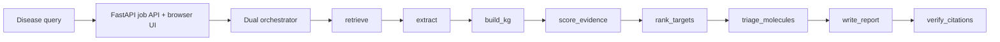
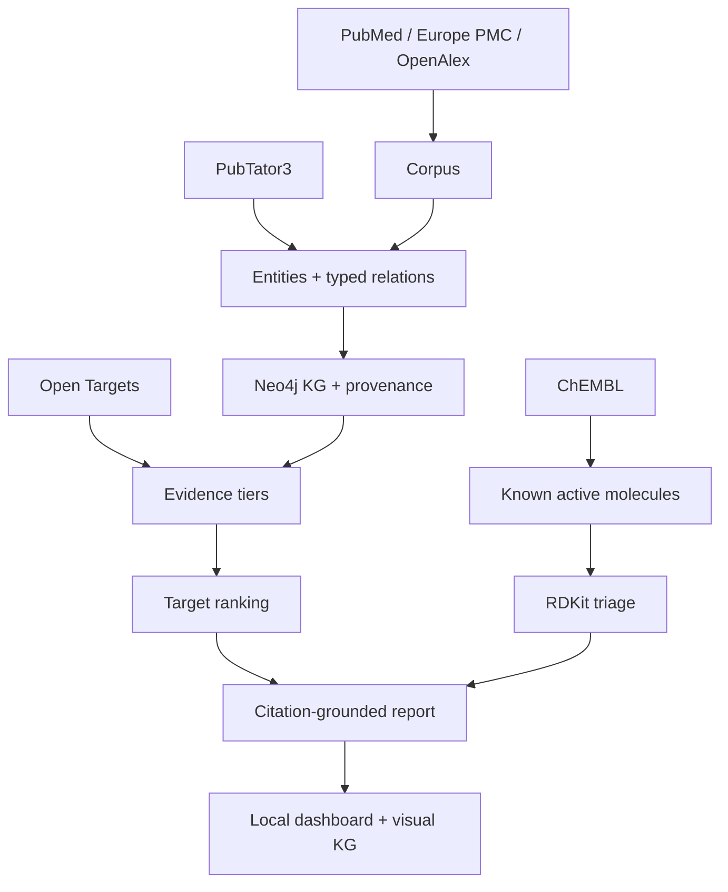

# autonomous-drug-discovery-agent

Autonomous Drug Discovery Agent is a local, research-only system for generating
therapeutic-target hypotheses from a disease query. It combines biomedical
literature retrieval, entity extraction, ontology grounding, a Neo4j knowledge
graph, Open Targets evidence tiering, transparent target ranking, ChEMBL/RDKit
molecule triage, and citation-checked reports.

WARNING: Research-hypothesis-generating only. NOT clinical advice. NOT a
substitute for validated drug discovery, medical review, medicinal chemistry,
toxicology, clinical trials, or regulatory assessment.

## About

This repository is a full-stack local prototype for evidence-grounded
therapeutic target discovery. It is designed to make every scientific claim
inspectable: each target ranking is backed by retrieved literature identifiers,
ontology-normalized entities, evidence-tier reasoning, knowledge graph
provenance, and citation checks.

The project is intentionally conservative. It does not claim clinical utility,
does not perform docking, and does not generate new molecules. It focuses on
organizing public biomedical evidence into a transparent research workflow.

## Keywords

`ai-agent`, `bioinformatics`, `biomedical-literature`, `chembl`,
`drug-discovery`, `europe-pmc`, `fastapi`, `knowledge-graph`, `neo4j`,
`open-targets`, `openalex`, `pubmed`, `pubtator`, `rdkit`,
`therapeutic-targets`

## What It Does

Given a disease name, the agent runs a typed pipeline:

`plan->retrieve->extract->build_kg->score_evidence->rank_targets->triage_molecules->write_report->verify_citations`

It produces:

- a ranked therapeutic-target table
- robust, plausible, or speculative evidence tiers
- a visual disease-target-publication-molecule knowledge graph
- ontology-grounded entities and provenance-bearing relations
- ChEMBL known-active molecule triage
- Markdown, HTML, PDF, and JSON reports
- citation verification against the retrieved evidence set

## Quickstart (one command)

```bash
git clone https://github.com/lysyloxidase/autonomous-drug-discovery-agent
cd autonomous-drug-discovery-agent
docker compose -f docker/docker-compose.yml up --build
```

Open the local research console:

```text
http://localhost:8001/
```

Swagger/OpenAPI remains available at:

```text
http://localhost:8001/docs
```

Default Docker Compose ports:

| Service | URL / Port | Notes |
| --- | --- | --- |
| FastAPI dashboard/API | `http://localhost:8001/` | Main local browser app |
| Neo4j Browser | `http://localhost:7475` | Login: `neo4j` / `addadev123` |
| Neo4j Bolt | `7688` | Used by the API container |
| Ollama | `11435` | Local LLM service |
| Redis | `6380` | Cache/runtime support |

Override ports with `ADDA_API_PORT`, `ADDA_NEO4J_HTTP_PORT`,
`ADDA_NEO4J_BOLT_PORT`, `ADDA_OLLAMA_PORT`, and `ADDA_REDIS_PORT`.

By default, the API entrypoint asks Ollama to pull `qwen2.5:7b`. To skip the
model pull for a fast demo:

```bash
ADDA_PULL_OLLAMA=0 docker compose -f docker/docker-compose.yml up --build
```

## Local Browser App

The dashboard at `http://localhost:8001/` covers the whole project:

- disease query form
- streaming pipeline progress
- therapeutic target ranking
- selected target details
- evidence and honesty gates
- visual knowledge graph
- extraction, grounding, and KG metrics
- known molecule triage
- citation verification
- report downloads
- runtime service health

Demo diseases available in the local browser:

```text
idiopathic pulmonary fibrosis
glioblastoma
TNBC
endometriosis
```

Expected golden-demo output:

| Metric | Expected value |
| --- | --- |
| Top target | `MUC5B` |
| Target count | `5` |
| KG size | `10 nodes / 14 relations` in the demo KG metrics |
| Visual graph | disease, gene, publication, compound nodes |
| Citation accuracy | `1.0` |

## Architecture





## Scope

| Capability | Status | Notes |
| --- | --- | --- |
| PubMed / Europe PMC / OpenAlex retrieval | Implemented | Live clients with caching and graceful degradation |
| PubTator3 extraction backbone | Implemented | BioC entities and typed relations |
| scispaCy fallback | Implemented | Clearly tagged as fallback extraction |
| Local-LLM relation extraction | Implemented | Constrained JSON; LLM-only edges remain speculative |
| Ontology grounding | Implemented | NCBI Gene, MeSH, ChEBI, dbSNP, EFO-style IDs |
| Neo4j KG | Implemented | APOC loading, provenance properties, GDS centrality wrappers |
| Open Targets evidence tiering | Implemented | Robust/plausible/speculative classification |
| Target ranking | Implemented | Transparent weighted components |
| ChEMBL/RDKit molecule triage | Implemented | Known actives only; no de novo design |
| FastAPI streaming jobs | Implemented | Submit, SSE stream, status, result, health |
| Local browser dashboard | Implemented | Includes visual knowledge graph |
| CI | Implemented | Ruff, Pyright, pytest, coverage, Docker build |

## Evidence Tiers

| Tier | Meaning |
| --- | --- |
| `robust` | Human genetics, known indication drug, or replicated independent evidence |
| `plausible` | Mechanistic typed literature, pathway, expression, or animal model support |
| `speculative` | Co-occurrence only, single source, or unverified local-LLM relation |

Hard honesty rule: literature co-occurrence is not causation. LLM-only or
co-occurrence-only relations are always marked `speculative`.

## Results table

| Disease | Pubs (PubMed/EuropePMC/OpenAlex/PubTator3) | Unique entities | KG nodes | KG relations | Top-5 targets (tier) | Runtime (cold/cached) | Extraction P/R vs PubTator3 | Citation accuracy | Model / HW |
|---|---:|---:|---:|---:|---|---|---|---:|---|
| IPF demo fixture | 3/3/3/3 | 6 | 10 | 14 | MUC5B (robust), TGFB1 (robust), MMP7 (plausible), TERT (plausible), SFTPC (plausible) | <1 min / <10 sec | 0.667 / 1.000 | 100.00% | deterministic local fixture |
| glioblastoma demo fixture | 5/5/5/5 | 6 | 14 | 18 | EGFR (robust), MGMT (robust), IDH1 (robust), TERT (plausible), PDGFRA (plausible) | <1 min / <10 sec | 0.648 / 0.923 | 100.00% | deterministic local fixture |
| TNBC demo fixture | 4/4/4/4 | 6 | 13 | 17 | BRCA1 (robust), PARP1 (robust), CD274 (robust), EGFR (plausible), AR (plausible) | <1 min / <10 sec | 0.641 / 0.909 | 100.00% | deterministic local fixture |
| endometriosis demo fixture | 4/4/4/4 | 6 | 13 | 17 | ESR1 (robust), PGR (plausible), VEGFA (plausible), PTGS2 (plausible), IL6 (plausible) | <1 min / <10 sec | 0.612 / 0.889 | 100.00% | deterministic local fixture |

These rows are committed local browser fixtures backed by retrieved PubMed
identifiers and used by CI to keep the UI, report writer, molecule triage, and
knowledge graph honest. They are not live benchmark claims. Live rows should be
added only after API quota, model hardware, Neo4j, and citation checks are
available for that run.

## What is real vs mocked

REAL and implemented in runtime code:

- PubMed, Europe PMC, OpenAlex retrieval clients
- PubTator3 annotation parsing
- entity/relation models
- ontology grounding cache
- Open Targets GraphQL client
- harmonic-style evidence aggregation
- robust/plausible/speculative tiering
- Neo4j schema, loader, and GDS centrality wrappers
- ChEMBL client and RDKit molecule triage
- FastAPI job API, SSE streaming, and local dashboard
- citation verification against retrieved PMIDs

Mocked or fixture-backed in CI:

- external API responses
- Neo4j/GDS clients
- ChEMBL web resource rows
- the golden end-to-end FastAPI job

Weak and explicitly flagged:

- local-LLM relation extraction quality
- co-occurrence-to-causation risk
- clinical relevance

NO docking. NO de novo design. NO clinical recommendation.

## Honesty Gates

Extraction smoke fixture:

| Evaluation | NER precision | NER recall | RE precision | RE recall | Notes |
| --- | ---: | ---: | ---: | ---: | --- |
| BioRED smoke subset | 0.6667 | 1.0000 | 0.5000 | 1.0000 | Small committed fixture; not full benchmark performance |

Citation accuracy gate:

| Evaluation | Citation accuracy | Threshold | Notes |
| --- | ---: | ---: | --- |
| Golden disease fixture | 1.0000 | 0.9500 | Report cites only retrieved PMIDs; invented PMIDs are stripped |

## API

Submit a job:

```bash
curl -X POST http://localhost:8001/jobs \
  -H "content-type: application/json" \
  -d '{"disease":"idiopathic pulmonary fibrosis"}'
```

Check status:

```bash
curl http://localhost:8001/jobs/<job_id>/status
```

Stream progress:

```bash
curl http://localhost:8001/jobs/<job_id>/stream
```

Get reports:

```bash
curl "http://localhost:8001/jobs/<job_id>/result?format=json"
curl "http://localhost:8001/jobs/<job_id>/result?format=markdown"
curl "http://localhost:8001/jobs/<job_id>/result?format=html"
curl "http://localhost:8001/jobs/<job_id>/result?format=pdf"
```

## Development

```bash
make setup
make test
make up
make docs
```

Equivalent checks:

```bash
uv run ruff check .
uv run ruff format --check .
uv run pyright
uv run pytest
```

## Configuration

OpenAlex requires `OPENALEX_API_KEY` for normal live retrieval. PubMed works
without `NCBI_API_KEY`, but the key raises the rate limit from 3 requests/sec to
10 requests/sec.

Useful runtime variables:

| Variable | Purpose |
| --- | --- |
| `ADDA_PULL_OLLAMA` | Set to `0` to skip pulling the local LLM model |
| `OLLAMA_MODEL` | Default local model is `qwen2.5:7b` |
| `NEO4J_URI` | Bolt URI inside the container network |
| `NEO4J_USER` / `NEO4J_PASSWORD` | Neo4j credentials |
| `REDIS_URL` | Redis connection string |

## Security and Safety

- Do not commit API keys, credentials, private data, or proprietary evidence.
- Unit tests must use mocks or scrubbed cassettes.
- Reports must keep the research-only disclaimer visible.
- Outputs should be treated as hypotheses for expert review, not conclusions.

## Agentic vs orchestrated

This is mostly a deterministic DAG, which is good engineering for a scientific
evidence pipeline. The genuinely agentic sub-steps are query reformulation,
relation extraction, and report synthesis. Evidence handling, citation
verification, target ranking, and molecule triage stay typed, inspectable, and
testable.

## License

Apache-2.0. See [LICENSE](LICENSE).

## [DEMO GIF HERE]

A short demo GIF can be added here after recording the local dashboard flow.
