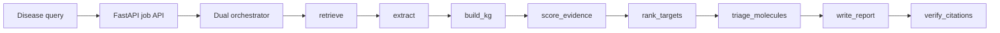
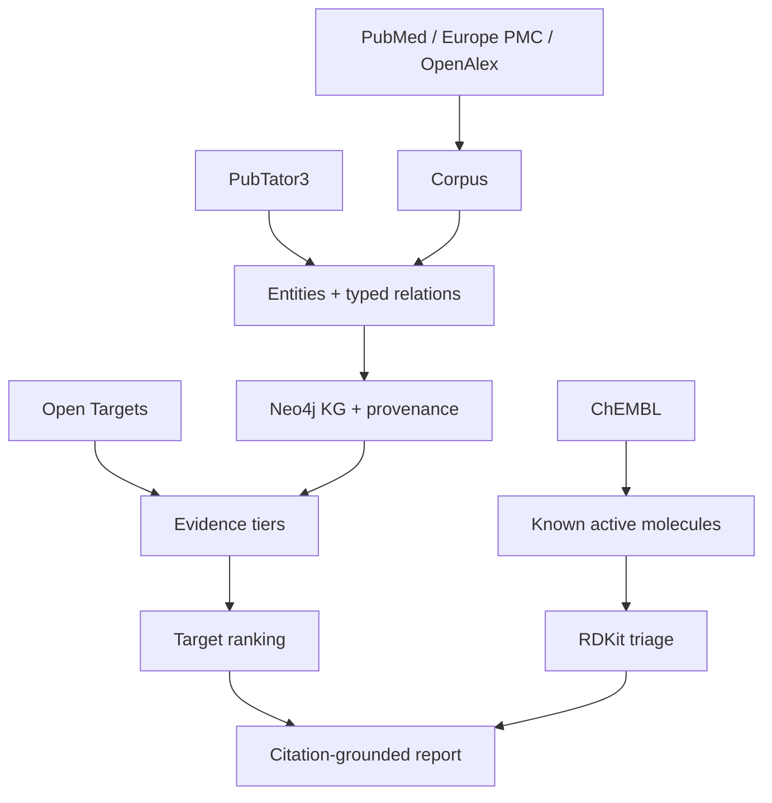

# autonomous-drug-discovery-agent

An autonomous AI agent that takes a disease name and produces a
citation-grounded, evidence-tiered therapeutic-target report by combining
literature retrieval, PubTator3/Open Targets/ChEMBL grounding, a Neo4j knowledge
graph, transparent target ranking, and RDKit molecule triage. The report layer
runs with local LLM infrastructure through Ollama, so there is no hosted LLM API
cost.

WARNING: Research-hypothesis-generating only. NOT clinical advice. NOT a
substitute for validated drug discovery.

## Quickstart (one command)

```bash
git clone https://github.com/lysyloxidase/autonomous-drug-discovery-agent
cd autonomous-drug-discovery-agent
docker compose -f docker/docker-compose.yml up
```

Open `http://localhost:8000/docs`, `POST /jobs` with a disease, then watch
`GET /jobs/{job_id}/stream` for step-by-step SSE progress. The compose stack
starts Neo4j with APOC/GDS, Ollama, Redis, and the FastAPI service. Local LLM +
Neo4j are the heavy consumers; plan for at least 16 GB RAM for a comfortable
demo and more for real workloads. The API entrypoint asks Ollama to pull
`qwen2.5:7b` on first run.

## [DEMO GIF HERE]

Demo target: idiopathic pulmonary fibrosis.

```bash
make demo
```

Example report outputs are available from:

- `GET /jobs/{job_id}/result?format=markdown`
- `GET /jobs/{job_id}/result?format=html`
- `GET /jobs/{job_id}/result?format=pdf`
- `GET /jobs/{job_id}/result?format=json`

## Results table

| Disease | Pubs (PubMed/EuropePMC/OpenAlex/PubTator3) | Unique entities | KG nodes | KG relations | Top-5 targets (tier) | Runtime (cold/cached) | Extraction P/R vs PubTator3 | Citation accuracy | Model / HW |
|---|---:|---:|---:|---:|---|---|---|---:|---|
| IPF demo fixture | 3/3/3/3 | 6 | 7 | 5 | MUC5B (robust), TGFB1 (robust), MMP7 (plausible), TERT (plausible), SFTPC (plausible) | <1 min / <10 sec | 0.667 / 1.000 | 100.00% | qwen2.5:7b / local CPU demo |
| glioblastoma | pending live run | pending | pending | pending | pending | pending | pending | pending | pending |
| TNBC | pending live run | pending | pending | pending | pending | pending | pending | pending | pending |
| endometriosis | pending live run | pending | pending | pending | pending | pending | pending | pending | pending |

The IPF row is the committed golden disease fixture used by CI. Live runs can
replace the pending rows when API quotas, model hardware, and Neo4j are
available.

## What is real vs mocked

REAL and verifiable in runtime code: PubMed/OpenAlex/Europe PMC retrieval,
PubTator3 entity and relation annotation parsing, ChEMBL bioactivity lookup,
Open Targets scores, RDKit property calculation, Neo4j KG loading, Graph Data
Science centrality wrappers, and citation existence/retrieval-set verification.

Mocked or fixture-backed in CI: external API responses, Neo4j/GDS clients,
ChEMBL Web Resource Client rows, and the golden end-to-end FastAPI job. CI never
hits live APIs by default; optional live integration is `workflow_dispatch`
only.

WEAK and flagged: local-LLM relation extraction quality, the
co-occurrence-to-causation leap, and clinical relevance. LLM-only or
co-occurrence-only relations are forced to `speculative`. NO docking. NO de novo
design.

## Architecture





Agent flow:

`plan->retrieve->extract->build_kg->score_evidence->rank_targets->triage_molecules->write_report->verify_citations`

## Agentic vs orchestrated

This is mostly a deterministic DAG, which is good engineering for a scientific
evidence pipeline. The genuinely agentic sub-steps are query reformulation,
relation extraction, and report synthesis. Evidence handling, citation
verification, target ranking, and molecule triage stay typed, inspectable, and
testable.

## Scope

| Capability | Status | Notes |
| --- | --- | --- |
| PubMed / Europe PMC / OpenAlex retrieval | Implemented | Live clients with cache and graceful degradation |
| PubTator3 extraction backbone | Implemented | BioC entities and typed relations |
| scispaCy + local LLM fallback | Implemented | Tagged and measured; LLM-only remains speculative |
| Neo4j KG | Implemented | APOC loading, provenance on every edge, GDS centrality |
| Open Targets evidence tiering | Implemented | Robust/plausible/speculative |
| Target ranking | Implemented | Transparent weighted components |
| ChEMBL/RDKit molecule triage | Implemented | Known actives only |
| Dual orchestrator | Implemented | Custom state machine and LangGraph parity |
| FastAPI streaming jobs | Implemented | Submit, SSE stream, status, result, health |
| CI | Implemented | Ruff, Pyright, pytest with cassettes/fixtures, Docker build |

## Honesty gates

Extraction smoke fixture:

| Evaluation | NER precision | NER recall | RE precision | RE recall | Notes |
| --- | ---: | ---: | ---: | ---: | --- |
| BioRED smoke subset | 0.6667 | 1.0000 | 0.5000 | 1.0000 | Small committed fixture; not full benchmark performance |

Citation gate:

| Evaluation | Citation accuracy | Threshold | Notes |
| --- | ---: | ---: | --- |
| Golden disease fixture | 1.0000 | 0.9500 | Report cites only retrieved PMIDs; invented PMIDs are stripped |

## Development

```bash
make setup
make test
make up
make docs
```

OpenAlex requires `OPENALEX_API_KEY` for normal live retrieval. PubMed works
without `NCBI_API_KEY`, but the key raises the rate limit from 3 requests/sec to
10 requests/sec.
