# Architecture

```mermaid
flowchart LR
  Q[Disease query] --> M[Corpus assembler]
  M --> P[PubMed]
  M --> E[Europe PMC]
  M --> O[OpenAlex]
  M --> T[PubTator3]
  P --> D[Dedupe]
  E --> D
  O --> D
  T --> D
  D --> C[Corpus]
  C --> X[Entity extraction]
  X --> PT[PubTator3 ground truth]
  X --> SP[scispaCy fallback]
  X --> LLM[Local LLM relations]
  X --> G[Ontology grounding]
```

Each source has its own token bucket. Source failures are isolated so one
limited or unavailable API does not prevent corpus creation from the remaining
sources.

Phase 2 treats PubTator3 annotations as the authoritative backbone. scispaCy and
local-LLM extraction are supplemental and visibly tagged so later evidence
ranking can separate supported edges from speculative ones.
