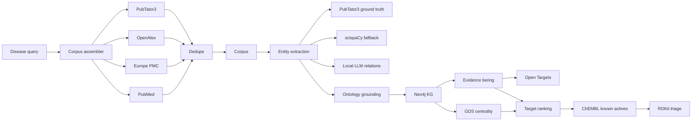

# Architecture

Each source has its own token bucket. Source failures are isolated so one
limited or unavailable API does not prevent corpus creation from the remaining
sources.

Phase 2 treats PubTator3 annotations as the authoritative backbone. scispaCy and
local-LLM extraction are supplemental and visibly tagged so later evidence
ranking can separate supported edges from speculative ones.

Phase 3 batch-loads grounded nodes and relationships into Neo4j with APOC.
Every edge carries provenance properties so downstream evidence ranking can
audit exactly where a graph claim came from.

Phase 4 adds Open Targets grounding and writes `evidence_tier` back onto graph
edges. Co-occurrence-only and unverified local-LLM edges remain speculative even
when they are present in the KG.

Phase 5 ranks targets with user-adjustable weights and keeps every score
component visible. Molecule triage is deliberately scoped to ChEMBL known
actives and RDKit property/filter analysis; it is not de novo design, docking,
or a clinical recommendation engine.
