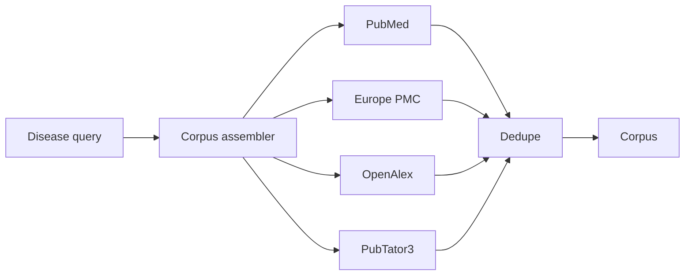

# Architecture

```mermaid
flowchart LR
  Q[Disease query] --> M[Corpus assembler]
  M --> P[PubMed]
  M --> E[Europe PMC]
  M --> O[OpenAlex]
  M --> T[PubTator3]
  P --> D[Dedupe]
  E --> D
  O --> D
  T --> D
  D --> C[Corpus]
```

Each source has its own token bucket. Source failures are isolated so one
limited or unavailable API does not prevent corpus creation from the remaining
sources.

